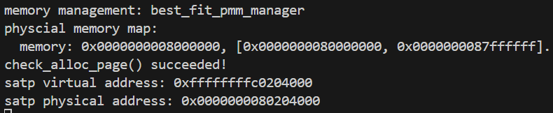

<h1 align="center"> 南开大学操作系统实验二 </h1>

<h5 align="center"><em>章壹程，仇科文，杨宇翔 </em></h5>

  <a href="##练习1：理解first-fit 连续物理内存分配算法（思考题）">练习1</a>|
  <a href="##练习2：实现 Best-Fit 连续物理内存分配算法（需要编程）">练习2</a>|
  <a href="##扩展练习Challenge：buddy system（伙伴系统）分配算法（需要编程）">buddy system</a>|
  <a href="##扩展练习Challenge：任意大小的内存单元slub分配算法（需要编程）">slub分配算法</a>|
  <a href="##扩展练习Challenge：硬件的可用物理内存范围的获取方法（思考题）">可用物理内存范围的获取方法</a>|
  <a href="##分工">分工</a>

## 练习1：理解first-fit 连续物理内存分配算法（思考题）

| 函数名称                  | 功能                                                         |
| :------------------------ | :----------------------------------------------------------- |
| **`default_init`**        | 初始化内存管理系统，准备一个空的空闲链表并将空闲页面计数器清零 |
| **`default_init_memmap`** | 构建初始的空闲内存块。它设置起始页的`property`为整个块的大小，并将其按**地址递增的顺序**插入到空闲链表中 |
| **`default_alloc_pages`** | 分配 n 个连续的物理页。它沿着空闲链表进行线性搜索，找到**第一个满足大小的空闲块**。如果该块大于所需，则进行分割，并将剩余部分作为新空闲块加回链表。 |
| **`default_free_pages`**  | 释放内存页，并根据地址检查前后相邻的块是否也是空闲的。如果是，则进行合并，形成一个更大的连续空闲块。 |

### 改进空间

#### 1. 引入分配阈值

当前算法在找到的空闲块大于需求时，会进行分割，这可能导致产生大量难以利用的小碎片。可以设置一个阈值，当剩余空间小于该阈值时，不再分割，而是将整个空闲块分配出去。这样可以减少内存碎片，并减少链表节点数量从而加快查找。

#### 2. 循环首次适应算法

当前算法每次分配都从链表头部开始搜索，这可能导致低地址部分产生大量小碎片，并增加平均查找时间。循环首次适应算法通过记录上次分配结束的位置，下一次分配从该位置开始搜索，使分配更均匀。

## 练习2：实现 Best-Fit 连续物理内存分配算法（需要编程）

| 函数名称                   | 设计                                               |
| :------------------------- | :------------------------------------------------- |
| **`best_fit_init`**        | 保持 first fit 的代码不变                          |
| **`best_fit_init_memmap`** | 保持 first fit 的代码不变                          |
| **`best_fit_alloc_pages`** | 遍历所有空闲块，选择大小最接近请求的空闲块进行分配 |
| **`best_fit_free_pages`**  | 保持 first fit 的代码不变                          |

> 成功运行截图

### 改进空间

#### 1、优化数据结构

当前使用简单链表，查找是线性的。最有效的优化是使用更高效的数据结构来管理空闲块。例如将空闲块按其大小组织成 **大小索引的链表数组**。

#### 2、内存池

系统调用需要从用户空间切换到内核空间，涉及上下文切换、权限拷贝、数据拷贝等开销，因此反复请求内存造成的频繁系统调用会严重影响性能。而内存池**将频繁的系统调用转化为极少次的内部分配**，分配和释放速度远超通用分配器。

具体来说，内存池为内核中常用的对象（如进程描述符、文件句柄等）预先分配好一整块内存（内存池）。

内存池创建时，它会一次性向操作系统申请一块较大的连续内存。这块内存被划分为多个大小相等的内存块，这些空闲块通常通过一个链表串联起来管理。

当程序请求内存时，内存池分配器不再调用 `malloc`或 `new`，而是直接从空闲链表中取出第一块，调整链表指针后，将这块内存的地址返回给用户。这个过程几乎只是几次指针操作，因此速度极快。

当程序释放内存时，内存池分配器也不会立即调用 `free`或 `delete`将其还给操作系统，而是将这块内存重新插入到空闲链表中，以备下次分配使用。

#### 3、引入分配阈值

与 first fit 时提到的改进相同。

#### 4、增强碎片合并机制

当前的合并操作仅在释放时检查直接相邻的块。可以增强这一机制。在系统负载较低时，或当碎片数量达到一定阈值后，触发一次全局的内存紧缩，将所有的空闲块合并成一个大块。

## 扩展练习Challenge：buddy system（伙伴系统）分配算法（需要编程）

## 扩展练习Challenge：任意大小的内存单元slub分配算法（需要编程）

## 扩展练习Challenge：硬件的可用物理内存范围的获取方法（思考题）

## 分工

- [章壹程](https://github.com/u2003yuge)：环境配置、Readme.md 排版、git 管理
- [仇科文](https://github.com/luyanhexay)：完成问题一
- [杨宇翔](https://github.com/sheepspacefly)：完成问题二

> 