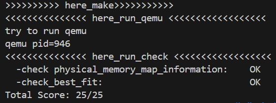

<h1 align="center"> 南开大学操作系统实验二 </h1>
<p align="center">
<a href="https://cc.nankai.edu.cn/"></a>
<a href="http://oslab.mobisys.cc/"></a>
</p>
<h5 align="center"><em>章壹程，仇科文，杨宇翔 </em></h5>
<p align="center">
<p align="center">
  <a href="##练习1：理解first-fit 连续物理内存分配算法（思考题）">练习1</a>|
  <a href="##练习2：实现 Best-Fit 连续物理内存分配算法（需要编程）">练习2</a>|
  <a href="## Challenge1：buddy system">challenge 1</a>|
  <a href="## Challenge2：slub">challenge 2</a>|
  <a href="## Challenge3：硬件的可用物理内存范围的获取方法（思考题）">challenge 3</a>|
  <a href="##分工">分工</a>
</p>


## 练习1：理解first-fit 连续物理内存分配算法（思考题）

| 函数名称                  | 功能                                                         |
| :------------------------ | :----------------------------------------------------------- |
| **`default_init`**        | 初始化内存管理系统，准备一个空的空闲链表并将空闲页面计数器清零 |
| **`default_init_memmap`** | 构建初始的空闲内存块。它设置起始页的`property`为整个块的大小，并将其按**地址递增的顺序**插入到空闲链表中 |
| **`default_alloc_pages`** | 分配 n 个连续的物理页。它沿着空闲链表进行线性搜索，找到**第一个满足大小的空闲块**。如果该块大于所需，则进行分割，并将剩余部分作为新空闲块加回链表。 |
| **`default_free_pages`**  | 释放内存页，并根据地址检查前后相邻的块是否也是空闲的。如果是，则进行合并，形成一个更大的连续空闲块。 |

### 改进空间

#### 1. 引入分配阈值

当前算法在找到的空闲块大于需求时，会进行分割，这可能导致产生大量难以利用的小碎片。可以设置一个阈值，当剩余空间小于该阈值时，不再分割，而是将整个空闲块分配出去。这样可以减少内存碎片，并减少链表节点数量从而加快查找。

#### 2. 循环首次适应算法

当前算法每次分配都从链表头部开始搜索，这可能导致低地址部分产生大量小碎片，并增加平均查找时间。循环首次适应算法通过记录上次分配结束的位置，下一次分配从该位置开始搜索，使分配更均匀。

## 练习2：实现 Best-Fit 连续物理内存分配算法（需要编程）

| 函数名称                   | 设计                                               |
| :------------------------- | :------------------------------------------------- |
| **`best_fit_init`**        | 保持 first fit 的代码不变                          |
| **`best_fit_init_memmap`** | 保持 first fit 的代码不变                          |
| **`best_fit_alloc_pages`** | 遍历所有空闲块，选择大小最接近请求的空闲块进行分配 |
| **`best_fit_free_pages`**  | 保持 first fit 的代码不变                          |



> 成功运行截图

### 改进空间

#### 1、优化数据结构

当前使用简单链表，查找是线性的。最有效的优化是使用更高效的数据结构来管理空闲块。例如将空闲块按其大小组织成 **大小索引的链表数组**。

#### 2、内存池

系统调用需要从用户空间切换到内核空间，涉及上下文切换、权限拷贝、数据拷贝等开销，因此反复请求内存造成的频繁系统调用会严重影响性能。而内存池**将频繁的系统调用转化为极少次的内部分配**，分配和释放速度远超通用分配器。

具体来说，内存池为内核中常用的对象（如进程描述符、文件句柄等）预先分配好一整块内存（内存池）。

内存池创建时，它会一次性向操作系统申请一块较大的连续内存。这块内存被划分为多个大小相等的内存块，这些空闲块通常通过一个链表串联起来管理。

当程序请求内存时，内存池分配器不再调用 `malloc`或 `new`，而是直接从空闲链表中取出第一块，调整链表指针后，将这块内存的地址返回给用户。这个过程几乎只是几次指针操作，因此速度极快。

当程序释放内存时，内存池分配器也不会立即调用 `free`或 `delete`将其还给操作系统，而是将这块内存重新插入到空闲链表中，以备下次分配使用。

#### 3、引入分配阈值

与 first fit 时提到的改进相同。

#### 4、增强碎片合并机制

当前的合并操作仅在释放时检查直接相邻的块。可以增强这一机制。在系统负载较低时，或当碎片数量达到一定阈值后，触发一次全局的内存紧缩，将所有的空闲块合并成一个大块。

## Challenge1：buddy system
### 方法简述
- 只能分配2的幂次方的页，即页大小为2^n，n为0,1,2,3...
- 维护一个二叉树，保存左右儿子的最大可分配连续页数
- 分配过程：
  - 将所需页面大小扩大到2的幂次方
  - 优先分配右儿子
  - 如果右儿子没有足够大的连续页，则再分配左儿子；
  - 若左儿子也没有足够大的连续页，则分配自身（要求自身空闲）
  - 若自身也没有足够大的连续页，则分配失败
  - 将分配页左右儿子的最大可分配连续页数更新为0
  - 逐级向父亲节点更新左右儿子的最大可分配连续页数
- 释放过程：
  - 将大小扩大到2的幂次方
  - 找到页对应的二叉树节点，将其左右儿子的最大可分配连续页数更新为满
  - 逐级向父亲节点更新左右儿子的最大可分配连续页数
    - 若父亲节点的左右儿子的最大可分配连续页数都为满，则将父亲节点的最大可分配连续页数设为满向上传递
    - 否则取左右儿子最大值
### 实现细节
#### 二叉树节点设计
一个二叉树节点需要有以下属性，且节点数为2*n+1：
- 左儿子的索引
- 右儿子的索引
- 父亲的索引
- 左儿子的最大可分配连续页数（left_max）
- 右儿子的最大可分配连续页数（right_max）

但是这些属性太多了，对空间的要求太大，要考虑**进行压缩**。

如果节点之间连续，或者说以某种逻辑顺序排列，那么就可以不需要父亲索引、左儿子索引、右儿子索引。如果地址连续，假设当且节点为x，则父亲节点为x/2，左儿子为2x，右儿子为2x+1。

接下来就是左右儿子的最大可分配连续页数，可以每个节点仅维护自己的最大可分配连续页数，访问左右儿子最大可分配连续页数直接查找左右儿子即可，**但这样访存次数太多**，而且我之前没想到，所以还是同时维护了`left_max`和`right_max`。

#### 节点内存分配
- 由于节点的数量约为总页数的两倍，因此需要在一个虚拟页`Page`中**分配两个节点的空间**。而为了让我们实现的页`Page_bt`与`Page`能对齐，分配给节点的空间最大为`size_of(page_link_t)`，即64字节。而如果给一个节点分配两个int大小的空间，总共占用了128字节，**超出限制**。
- 考虑进行优化：最大可分配连续页数必为2的整数幂，因此可以用`log2(n)`表示，因此仅需要一个`unsigned char`大小的空间来保存最大可分配连续页数，两个节点仅需要32字节的空间，剩余空间用char数组填充以保证对齐。
#### 关键函数代码
``` c++
struct binary_tree_node{//二叉树节点
    unsigned char left_max;
    unsigned char right_max;
};

struct Page_bt {//页
    int ref;                        
    uint64_t flags;                 
    unsigned int property;          
    binary_tree_node_t node[2];
    char vacancy[sizeof(list_entry_t) - 2 * sizeof(binary_tree_node_t)];  //填空对齐
};

#define LEFT_LEAF(index) ((index<<1)|1) //左儿子索引
#define RIGHT_LEAF(index) ((index+1)<<1) // 右儿子索引
#define PARENT(index) (((index+1)>>1)-1)// 父亲索引

int get_index(int offset, int property, int tot_size);//根据页偏移量获取二叉树节点索引
get_node(index);//根据二叉树节点索引获取节点指针
```

### 测试
`make grade_buddy`
- 测试一：
  - 先分配total_size/2+1大小的页：分配成功
  - 再分配1大小的页：分配失败
  - 清空
- 测试二：
  - 先分配大小为1的页：分配成功
  - 再分配大小为2的页：分配成功
  - ······
  - 再后分配到大小为total_size/2大小的页：分配成功
  - 再分配大小为1的页：分配成功
  - 再分配大小为1的页：分配失败
  - 清空
- 测试三：
  - 先分配大小为total_size/2大小的页：分配成功
  - 再分配大小为total_size/4大小的页: 分配成功
  -  ······
  - 再分配大小为1的页：分配成功
  - 再分配大小为1的页：分配失败
  - 清空
- 测试四：
  - 分配total_size+1大小的页：分配失败
  - 清空
## Challenge2：slub

## Challenge3：硬件的可用物理内存范围的获取方法（思考题）

### 问题分析

这个问题要求我们思考：如果OS无法提前知道当前硬件的可用物理内存范围，应该如何获取？

首先，我回顾了一下当前实验中的实现方式。在我们的lab2实现中，系统是通过设备树来获取物理内存信息的。该过程简单来说包含以下三个步骤：

1. OpenSBI在启动时扫描硬件，将结果以DTB格式保存在物理内存中
2. OpenSBI将DTB的物理地址通过`a1`寄存器传递给内核
3. 内核在`dtb_init()`函数中解析DTB，提取`memory`节点的`reg`属性

由此，内核获得了物理内存的起始地址(`0x80000000`)和大小(`128MB`)。

但如果OS无法提前知道这些信息，也没有固件提供DTB或类似机制，那该怎么办呢？我查阅了一些资料，总结出以下三种可能的方法。第一个方法不依赖于任何固件和硬件但是有不少缺陷，第二个方法依赖于固件，第三个方法依赖于硬件。

### 方法一：内存探测

简单来说就是try and error，**尝试读写访问**不同的内存地址，并根据**访问是否成功**来判断该地址是否对应有效的物理内存。实现方法大致如下：

- 从已知的起始地址开始，以一定步长（如4KB或1MB）递增地址：
  - 尝试向该地址写入一个特殊值，再读取该值，随后验证读写是否成功且值是否匹配。若成功且匹配：
    - 认为该地址有效。
  - 否则（访问触发异常或读取值不匹配）：
    - 认为已超出物理内存范围。

_事实上这里还可以做一些优化：例如，如果递增后地址有效，则加倍步长后再递增；若无效，则减半步长后再次尝试判断地址有效性。_

这种做法**不依赖任何**固件或外部信息，可以凭空得到物理内存的可用范围信息。然而，由于需要**写入**、**捕获异常**、**迭代处理**等操作，该方法存在不少缺陷：

1. 由于需要向未知区域写入内容，该方法可能**破坏**已有的重要数据，例如如固件代码、设备寄存器之类。
2. 由于需要捕获访问无效地址的异常，该方法需要**异常处理机制**配合——不过这不是必需的，因为我们除了尝试读写之外，还会比较读和写的值是否相同。
3. 由于需要迭代处理，该方法**效率较低**，在大内存系统中尤是如此。
4. 除此之外，该方法**无法区分内存空洞**和真正的内存末尾。这是因为，内存空洞中的地址访问通常会导致读写不匹配（写入的值无法保留或读回），就像访问超出内存范围的地址一样。这样一来，探测过程会在遇到第一个内存空洞时就错误地认为已经到达了内存末尾，从而遗漏后续的可用内存区域。

然而，以上缺陷**都可以**在我们当前的实验中**被忽略**。由于我们的玩具OS是运行在QEMU模拟出的硬件环境中的，在makefile里它的配置如下：

``` makefile
qemu: $(UCOREIMG) $(SWAPIMG) $(SFSIMG)
 $(V)$(QEMU) \
  -machine virt \
  -nographic \
  -bios default \
  -device loader,file=$(UCOREIMG),addr=0x80200000
```

在 QEMU `virt` 平台上，OpenSBI代码、设备寄存器和保留区域位于 RAM 区域之外，那么只要探测范围仍在物理 RAM 内部，且避开了已知的 MMIO 区域，就不会破坏固件或设备寄存器，因此可以**忽略第1个缺陷**；**第2个缺陷本身即可忽略**；QEMU 配置没有显式使用 `-m` 指定内存大小，因此默认内存为 128 MiB；即使不进行优化、以 4KB 的步长进行读写探测，最多也只有 $128 \text{ MiB} / 4 \text{ KB} = 32768$ 次读写操作，对于整体性能而言微不足道，因此可以**忽略第3个缺陷**，如果不刻意生成包含多个不连续 `<reg>` 属性的设备树，使用默认且简单的配置时，QEMU 模拟的 RAM 区域是连续的，不会出现空洞，因此我们可以**忽略第4个缺陷**。

综上，这个方法的可行性最高。

### 方法二：通过固件接口查询

虽然题目假设"无法提前知道"，但在实际系统中，固件通常会提供标准接口来传递硬件信息。除了我们当前项目使用的、基于设备树获取内存信息的方法以外，我们还可以定义扩展SBI调用来查询内存信息，或者使用ACPI表来查询（在支持ACPI的RISC-V系统中可用）。

这类方法能获取**完整的内存布局信息**（包括保留区域、MMIO等），且多数情况下**标准化**易于实现。但它们**依赖于固件**支持——如果固件支持，我们直接从DTB获取就行，也用不着这里提到的其它方法。

### 方法三：读取硬件配置寄存器

某些硬件平台会在特定的配置寄存器或内存映射区域中存储内存大小信息，例如内存控制器的配置寄存器、芯片组配置空间、平台相关的MMIO区域、CMOS存储器（x86）等位置。

例如，如果可用从某个MMIO地址中读取内存配置，那么我们可用定义一个内存配置寄存器的地址、读取其中的值（通常以MB为单位），再转换为字节数，即可得到可用物理内存大小；使用该值配合可用内存开始地址，即可得到完整的可用物理内存范围。

这种方法需要事先知道寄存器的准确位置和格式，而不同厂商的硬件差异很大，因此**依赖于硬件**。这确实没有依赖于固件，但是由于一个OS可以在多种相同架构的不同硬件上运行，使用这个方式需要对每个硬件进行适配，比较麻烦。

## 分工

- [章壹程](https://github.com/u2003yuge)：challenge1
- [仇科文](https://github.com/luyanhexay)：challenge3
- [杨宇翔](https://github.com/sheepspacefly)：练习一、练习二
