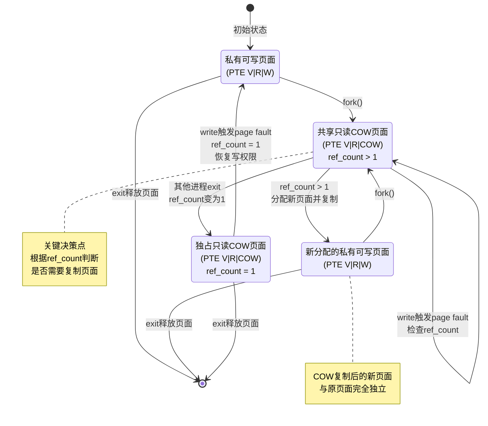

<h1 align="center"> 南开大学操作系统实验五 </h1>
<p align="center">
<a href="https://cc.nankai.edu.cn/"></a>
<a href="http://oslab.mobisys.cc/"></a>
<!-- </p>
<h5 align="center"><em>章壹程，仇科文，杨宇翔 </em></h5>
<p align="center">
  <a href="#练习 0：填写已有实验">练习0</a>|
  <a href="#练习 1: 加载应用程序并执行（需要编码）">练习1</a>|
  <a href="#练习 2: 父进程复制自己的内存空间给子进程（需要编码）">练习2</a>|
  <a href="#练习 3: 阅读分析源代码，理解进程执行 fork/exec/wait/exit 的实现，以及系统调用的实现（不需要编码）">练习3</a>|
  <a href="#扩展练习 Challenge ">扩展练习|

<a href="#分工">分工</a>

</p> -->

---

## 练习 0：填写已有实验

本练习要求将 Lab4 的代码合并到 Lab5 中。Lab4 实现了内核线程的创建、调度和同步机制，Lab5 在此基础上增加了用户进程的支持，包括用户态和内核态的切换、系统调用机制、以及进程的 fork/exec/wait/exit 等功能。

合并过程中需要注意进程管理相关的数据结构和函数。在`alloc_proc()`函数中（`kern/process/proc.c:90-130`），Lab5 相比 Lab4 新增了几个字段的初始化：

```c
proc->mm = NULL;                    // 用户内存管理结构
proc->tf = NULL;                    // 陷阱帧
proc->pgdir = boot_pgdir_pa;        // 页目录基地址（物理地址）
proc->wait_state = 0;               // 等待状态
proc->cptr = proc->yptr = proc->optr = NULL;  // 进程关系指针
```

这里有个细节要注意，`proc->pgdir`要初始化为`boot_pgdir_pa`而不是`boot_pgdir`。因为 RISC-V 的`satp`寄存器需要物理地址，如果填入虚拟地址会导致页表切换出错。

进程调度部分的代码基本保持不变，`proc_run()`函数仍然负责进程切换。不过在切换到用户进程时，页表的切换变得很重要。`lsatp()`函数加载新进程的页目录基地址，让进程拥有独立的虚拟地址空间。

Lab5 还引入了完整的系统调用框架。当用户进程执行`ecall`指令时，CPU 会陷入内核态，由`trap.c`中的异常处理程序接管。系统调用号和参数通过寄存器传递，内核根据系统调用号分发到具体的处理函数，执行完毕后将返回值写入`a0`寄存器，最终通过`sret`指令返回用户态。

## 练习 1: 加载应用程序并执行（需要编码）

本练习的任务是实现`load_icode()`函数，这个函数负责将用户程序的 ELF 格式二进制文件加载到新创建进程的用户空间中。Lab5 中用户程序在编译时就被嵌入到内核镜像里了。Makefile 通过链接器的`--format=binary`选项将编译好的用户程序 ELF 文件作为原始二进制数据链接进内核，链接器会自动生成三个符号，分别指向二进制数据的起始地址、大小和结束地址。

### do_fork() 的实现

进程创建流程在`do_fork()`函数中完成（`kern/process/proc.c:437-520`）。这次实验中我们需要修改两个地方：

**修改点 1：设置父进程关系**（第 468-470 行）

```c
// update step 1: set child proc's parent to current process, make sure current process's wait_state is 0
proc->parent = current;          // 设置父进程为当前进程
current->wait_state = 0;         // 确保当前进程的等待状态为0
```

这里将子进程的`parent`指针指向当前进程，并将当前进程的`wait_state`设为 0，表示当前进程不在等待子进程。

**修改点 2：插入进程到哈希表**（第 483-485 行）

```c
// update step 5: insert proc_struct into hash_list && proc_list, set the relation links of process
// 使用 set_links 函数设置进程关系，替代原来的直接添加到链表
set_links(proc);
```

调用`set_links()`函数。在`set_links()`内部（第 160-170 行）：

```c
static void
set_links(struct proc_struct *proc)
{
    list_add(&proc_list, &(proc->list_link));
    proc->yptr = NULL;
    if ((proc->optr = proc->parent->cptr) != NULL) {
        proc->optr->yptr = proc;
    }
    proc->parent->cptr = proc;
    nr_process++;
    hash_proc(proc);  // 将进程加入 hash_list，使 find_proc 能找到它
}
```

这个函数不仅建立了进程的父子关系和兄弟关系，还调用了`hash_proc(proc)`将进程加入哈希表。这个调用很重要，如果缺少这行，`find_proc()`就找不到新创建的进程，导致`wait()`等系统调用失败。

### 时钟中断处理

在`trap.c`的时钟中断处理中（第 127-136 行），我们添加了进程调度的触发机制：

```c
clock_set_next_event();
if (++ticks % TICK_NUM == 0) {
    print_ticks();
    if (current) {
        current->need_resched = 1;  // 标记当前进程需要重新调度
    }
    // ...
}
```

每隔`TICK_NUM`个时钟中断，就将当前进程的`need_resched`标志设为 1。这样在中断返回前，系统会检查这个标志，如果为 1 就调用`schedule()`切换到其他进程。这实现了时间片轮转的抢占式调度。

## 练习 2: 父进程复制自己的内存空间给子进程（需要编码）

本练习要实现`copy_range()`函数中的页面复制逻辑。当父进程调用`fork()`创建子进程时，子进程需要获得父进程地址空间的完整副本。也就是要将父进程的每一个有效页面都复制一份给子进程，并在子进程的页表中建立相应的映射。

### copy_range() 的实现

在`pmm.c`的`copy_range()`函数中（第 426-460 行），我们需要填写页面复制的代码。这个函数以页为单位遍历指定的虚拟地址范围，对于每个有效的页表项，执行复制操作。

```c
// get page from ptep
struct Page *page = pte2page(*ptep);

// 原始实现：分配新页面并复制
struct Page *npage = alloc_page();
assert(page != NULL);
assert(npage != NULL);

/* LAB5:EXERCISE2 YOUR CODE */
// (1) 获取源页面的内核虚拟地址（从Page结构体转换而来）。page是通过`pte2page(*ptep)`从页表项得到的，代表父进程的物理页面。
void *src_kvaddr = page2kva(page);
// (2) 获取目标页面的内核虚拟地址。npage是通过alloc_page()刚刚分配的空闲页面。
void *dst_kvaddr = page2kva(npage);
// (3) 从源地址复制到目标地址，大小为 PGSIZE。将整个页面（4096 字节）的数据从父进程页面复制到子进程页面。这是真正的数据复制操作。
memcpy(dst_kvaddr, src_kvaddr, PGSIZE);
// (4) 在子进程的页表中建立虚拟地址start到物理页面npage的映射，使用与父进程相同的权限位perm。
ret = page_insert(to, npage, start, perm);
```

### page_insert() 的作用

`page_insert()`函数不仅仅是修改页表项，它还会：

1. 检查目标虚拟地址是否已存在映射，如果存在则先移除旧映射
2. 增加新页面的引用计数（`page->ref++`）
3. 将新的映射关系写入页表
4. 刷新 TLB 保持地址转换的一致性

引用计数机制很重要，它记录了有多少个页表项指向同一个物理页面。当引用计数降为 0 时，物理页面才能被安全回收。

### 性能问题

这种页面复制方式虽然直接有效，但也存在效率问题。如果父进程占用了大量内存，`fork()`调用会消耗相当长的时间来复制所有页面。更严重的是，子进程可能在执行`exec()`替换自己的地址空间之前，根本不会访问这些复制的页面，导致复制操作完全是浪费。这个问题促使了写时复制(Copy-on-Write)机制的出现，这也是扩展练习中实现的优化技术。

## 练习 3: 阅读分析源代码，理解进程执行 fork/exec/wait/exit 的实现，以及系统调用的实现（不需要编码）

> 简要说明你对 fork/exec/wait/exit 函数的分析

- fork()函数：父进程复制自己，设置为等待状态，生成子进程，子进程复制父进程的内存空间，并返回子进程的 pid。
- exec()函数：在新进程中启动一个程序，保持 PID 不变，替换当前进程的内存空间与执行代码（以及改名字）。
- wait()函数: 使进程挂起设置等待状态为 WT_CHILD，等待某个儿子进程进入 PROC_ZOMBIE 状态，并释放其内核堆栈结构体的内存空间。
- exit()函数：释放几乎所有线程占用内存空间，并设置进程状态为 PROC_ZOMBIE，然后唤醒父进程。最后调度运行新的进程。
  > 请分析 fork/exec/wait/exit 的执行流程。重点关注哪些操作是在用户态完成，哪些是在内核态完成？
- sys_fork()函数：
  - 用户态操作：用户不需要提供任何参数，调用 fork()函数，系统调用会返回子进程的 pid。（clon_flags 参数为 0）
  - 内核态操作：
    - alloc_proc()函数：分配一个新的进程控制块，并初始化其中的成员变量。
    - 将新进程的父进程设置为当前进程，并将当前进程的等待状态设置为 0。
    - setup_kstack()函数：为新进程分配一个内核栈。
    - copy_mm()函数：复制当前进程的内存管理结构。
    - copy_thread()函数：设置 trapframe 与上下文，设置新进程的内核入口点和栈。
    - get_pid()函数：分配一个唯一的 pid。
    - set_links()函数（手搓）：将新进程插入到进程列表和哈希表中，设置进程间的关系。
    - wakeup_proc()函数：唤醒该进程。
- sys_exec 函数：
  - 用户态操作：用户提供程序名和程序 elf 文件，调用 exec()函数，系统调用会替换当前进程的内存空间与执行代码（以及改名字）。
  - 内核态操作：
    - 检查参数，修建名称长度。
    - 清空当前进程的内存管理结构。（exit_mmap(mm)，put_pgdir(mm)，mm_destroy(mm)）
    - 调用 load_icode() 函数，解析 ELF 文件，加载程序到内存,设置 trapframe 中的内容。
- sys_wait 函数：
  - 用户态：提供 pid 与 code_store 指针，调用 do_wait()。
  - 内核态：
    - 查找 pid 对应线程。
    - 若其为当前进程子进程，将当前进程设置为 PROC_SLEEPING 状态，同时设置 wait_state 为 WT_CHILD，等待该进程变为 PROC_ZOMBIE 状态。
    - 若 pid 对应进程为 PROC_ZOMBIE 状态，则将其从进程列表中删除，并释放其内核堆栈结构体的内存空间，并返回其退出码。
- sys_exit 函数：
  - 用户态：提供 error_code，调用 do_exit()。
  - 内核态：
    - 释放内存资源。
    - 唤醒等待的父进程。
    - 调用 scheduler() 函数，选择另一个进程运行。

> 内核态与用户态程序是如何交错执行的？内核态执行结果是如何返回给用户程序的？

- 通过 trapframe 进行切换。在 USER 态中，将各种参数存到寄存器中，再通过 ecall 指令产生异常，切换到内核态，在内核态中，根据 trapframe 中的内容进行相应的处理。
- 内核态 syscall 执行完毕后，将结果存入 trapframe a0 寄存器中，然后切换到用户态，将 ecall 的返回值（a0）存入 ret 中，从而返回 ret。

> 给出 ucore 中一个用户态进程的执行状态生命周期图包执行状态，执行状态之间的变换关系，以及产生变换的事件或函数调用）。（字符方式画即可）。

```
process state       :     meaning               -- reason
    PROC_UNINIT     :   uninitialized           -- alloc_proc
    PROC_SLEEPING   :   sleeping                -- try_free_pages, do_wait, do_sleep
    PROC_RUNNABLE   :   runnable(maybe running) -- proc_init, wakeup_proc,
    PROC_ZOMBIE     :   almost dead             -- do_exit

-----------------------------
process state changing:

  alloc_proc                                 RUNNING
      +                                   +--<----<--+
      +                                   + proc_run +
      V                                   +-->---->--+
PROC_UNINIT -- proc_init/wakeup_proc --> PROC_RUNNABLE -- try_free_pages/do_wait/do_sleep --> PROC_SLEEPING --
                                           A      +                                                           +
                                           |      +--- do_exit --> PROC_ZOMBIE                                +
                                           +                                                                  +
                                           -----------------------wakeup_proc----------------------------------
```

哇，十步之内必有解药。

## 扩展练习 Challenge

### 实现 Copy on Write （COW）机制

#### 一、实现概述

Copy-on-Write（写时复制）是一种优化技术，在父进程创建子进程时，不立即复制内存页面，而是让父子进程共享只读页面。当任一进程试图写入时，才触发页面复制操作。这样可以显著减少 fork 系统调用的开销。

本实现在 uCore 的 RISC-V 架构上完成了 COW 机制，并分析了著名的 Dirty COW 漏洞（CVE-2016-5195）的原理与防御方法。

#### 二、实现过程

COW 机制的实现涉及以下关键文件和函数：

##### 2.1 PTE 标志位定义（`libs/riscv.h`）

在 RISC-V 的页表项中，PTE 有 Reserved for Software（RSW）位，可供操作系统自定义使用。我们使用 RSW 的第 8 位来标记 COW 页面：

```c
#define PTE_COW 0x100  // Copy-on-Write (RSW bit 8)
```

这个标志位用于区分普通的只读页面（`PTE_R` 但没有 `PTE_W` 和 `PTE_COW`）和 COW 共享页面（`PTE_R | PTE_COW` 但没有 `PTE_W`）。

##### 2.2 内存复制函数（`kern/mm/pmm.c: copy_range`）

`copy_range`函数负责在 fork 时复制父进程的内存空间。我们为其添加了`share`参数，用于选择传统复制还是 COW 共享：

```c
int copy_range(pde_t *to, pde_t *from, uintptr_t start, uintptr_t end,
               bool share)
{
    // 遍历每个页面
    do {
        pte_t *ptep = get_pte(from, start, 0), *nptep;
        if (*ptep & PTE_V) {
            uint32_t perm = (*ptep & PTE_USER);
            struct Page *page = pte2page(*ptep);

            if (share) {
                // COW模式：共享页面
                // 1. 清除写权限，设置COW标志
                if (perm & PTE_W) {
                    *ptep = (*ptep & ~PTE_W) | PTE_COW;
                    perm = (perm & ~PTE_W) | PTE_COW;
                }

                // 2. 增加页面引用计数
                page_ref_inc(page);

                // 3. 为子进程创建相同的PTE
                ret = page_insert(to, page, start, perm);

                // 4. 刷新父进程TLB
                tlb_invalidate(from, start);
            } else {
                // 传统模式：立即复制
                struct Page *npage = alloc_page();
                memcpy(page2kva(npage), page2kva(page), PGSIZE);
                ret = page_insert(to, npage, start, perm);
            }
        }
        start += PGSIZE;
    } while (start != 0 && start < end);
    return 0;
}
```

我们做了这样几件事：

1. 清除写权限：将父进程和子进程的 PTE 都设置为只读（`~PTE_W`），任何写操作都会触发 page fault
2. 设置 COW 标志：添加`PTE_COW`标志，在 page fault 处理时区分是 COW 还是真正的权限错误
3. 引用计数管理：`page_ref_inc(page)`增加物理页面的引用计数，用于判断页面是否被多个进程共享
4. TLB 刷新：修改父进程 PTE 后需要刷新 TLB，确保新的权限立即生效

##### 2.3 启用 COW（`kern/mm/vmm.c: dup_mmap`）

在`do_fork`调用的`dup_mmap`函数中启用 COW 机制：

```c
int dup_mmap(struct mm_struct *to, struct mm_struct *from)
{
    list_entry_t *list = &(from->mmap_list), *le = list;
    while ((le = list_prev(le)) != list) {
        struct vma_struct *vma = le2vma(le, list_link);
        struct vma_struct *nvma = vma_create(vma->vm_start, vma->vm_end, vma->vm_flags);
        insert_vma_struct(to, nvma);

        // 启用COW
        bool share = 1;
        if (copy_range(to->pgdir, from->pgdir, vma->vm_start, vma->vm_end, share) != 0) {
            return -E_NO_MEM;
        }
    }
    return 0;
}
```

将`share`参数设置为 1 即可启用 COW 机制。

##### 2.4 页面错误处理（`kern/mm/vmm.c: do_pgfault`）

`do_pgfault`是 COW 机制的核心，负责处理写时复制的 page fault：

```c
int do_pgfault(struct mm_struct *mm, uint32_t error_code, uintptr_t addr) {
    // 查找VMA
    struct vma_struct *vma = find_vma(mm, addr);
    if (vma == NULL || vma->vm_start > addr) {
        goto failed;
    }

    // 获取页表项
    pte_t *ptep = get_pte(mm->pgdir, addr, 0);

    // 情况1：页面不存在（不应该发生在COW中）
    if (ptep == NULL || !(*ptep & PTE_V)) {
        struct Page *page = alloc_page();
        ret = page_insert(mm->pgdir, page, addr, PTE_U | PTE_R | PTE_W);
        return 0;
    }

    // 情况2：COW页面错误
    if ((*ptep & PTE_V) && (*ptep & PTE_COW)) {
        struct Page *page = pte2page(*ptep);

        // 检查页面是否共享（引用计数 > 1）
        if (page_ref(page) > 1) {
            // 共享页面：需要分配新页面并复制
            struct Page *npage = alloc_page();
            memcpy(page2kva(npage), page2kva(page), PGSIZE);

            // 恢复写权限，清除COW标志
            uint32_t perm = (*ptep & PTE_USER) | PTE_W;
            perm &= ~PTE_COW;

            // 移除旧映射，插入新页面
            page_remove(mm->pgdir, addr);
            ret = page_insert(mm->pgdir, npage, addr, perm);
        } else {
            // 独占页面：只需恢复写权限
            *ptep = (*ptep & ~PTE_COW) | PTE_W;
            tlb_invalidate(mm->pgdir, addr);
        }
        return 0;
    }

    // 情况3：写只读页面（非COW）- 这是错误
    if (error_code == CAUSE_STORE_PAGE_FAULT && !(*ptep & PTE_W)) {
        return -E_NO_MEM;
    }

    return 0;
}
```

我们做了这样几件事：

1. 引用计数判断：`page_ref(page) > 1`表示页面被多个进程共享，需要复制；`= 1`表示只有当前进程使用，直接恢复写权限即可
2. 页面复制：使用`memcpy`复制整个页面（4KB）的内容到新分配的页面
3. 权限恢复：清除`PTE_COW`标志，设置`PTE_W`标志，使页面可写
4. 页表更新：`page_remove`会减少旧页面的引用计数，`page_insert`会建立新页面的映射

##### 2.5 异常处理集成（`kern/trap/trap.c`）

在 trap handler 中调用`do_pgfault`处理页面错误：

```c
case CAUSE_STORE_PAGE_FAULT:
    // 处理COW的store page fault
    if ((tf->status & SSTATUS_SPP) == 0) {  // 用户态
        if (do_pgfault(current->mm, CAUSE_STORE_PAGE_FAULT, tf->tval) != 0) {
            cprintf("Store/AMO page fault\n");
            do_exit(-E_KILLED);
        }
    }
    break;
```

#### 三、COW 机制状态转换

COW 机制可以用有限状态自动机表示，包含以下状态：

- PRIVATE_RW：私有可写页面（正常状态）
- SHARED_RO_COW：共享只读 COW 页面（fork 后）
- EXCLUSIVE_RO_COW：独占只读 COW 页面（ref_count=1）
- PRIVATE_RW_NEW：新分配的私有可写页面（COW 复制后）

状态转换图：



状态转换表：

| 当前状态       | 事件   | 条件   | 下一状态       | 操作                          |
| -------------- | ------ | ------ | -------------- | ----------------------------- |
| PRIVATE_RW     | fork() | -      | SHARED_RO_COW  | 清除 W 位，设置 COW 位，ref++ |
| SHARED_RO_COW  | write  | ref>1  | PRIVATE_RW_NEW | 分配新页面，复制内容，ref--   |
| SHARED_RO_COW  | write  | ref==1 | PRIVATE_RW     | 恢复 W 位，清除 COW 位        |
| PRIVATE_RW_NEW | fork() | -      | SHARED_RO_COW  | 清除 W 位，设置 COW 位，ref++ |
| SHARED_RO_COW  | exit() | ref>1  | SHARED_RO_COW  | ref--                         |
| SHARED_RO_COW  | exit() | ref==1 | 释放           | free_page()                   |

#### 四、测试方式与结果

##### 4.1 测试程序设计（`user/cowtest.c`）

我们设计了一个测试程序来验证 COW 机制：

```c
#define ARRAY_SIZE 1024

int main(void) {
    cprintf("COW Test: Starting\n");

    static int shared_data[ARRAY_SIZE];

    // 父进程初始化数据
    for (int i = 0; i < ARRAY_SIZE; i++) {
        shared_data[i] = i;
    }

    int pid = fork();

    if (pid == 0) {
        // 子进程：读取验证共享
        cprintf("Child: Reading first value: %d\n", shared_data[0]);

        // 写入触发COW
        for (int i = 0; i < ARRAY_SIZE; i++) {
            shared_data[i] = i + 1000;
        }

        cprintf("Child: COW write successful! Values: %d, %d, %d...\n",
                shared_data[0], shared_data[1], shared_data[2]);
        exit(0);
    } else {
        // 父进程：也写入触发COW
        yield();
        for (int i = 0; i < ARRAY_SIZE; i++) {
            shared_data[i] = i + 2000;
        }

        cprintf("Parent: COW write successful! Values: %d, %d, %d...\n",
                shared_data[0], shared_data[1], shared_data[2]);
        waitpid(pid, NULL);
    }

    return 0;
}
```

测试逻辑：

1. 父进程初始化一个 1024 元素的数组为 0-1023
2. fork 创建子进程，此时父子进程共享页面（只读+COW）
3. 子进程读取数据验证共享（不触发 page fault）
4. 子进程写入新值 1000-2023（触发 COW，分配新页面）
5. 父进程写入不同的值 2000-3023（触发 COW，分配另一个新页面）
6. 验证父子进程的数据互不影响

##### 4.2 测试结果

编译并运行测试程序：

```bash
$ make clean && make
$ make qemu
```

实际输出：

```
OpenSBI v0.4 (Jul  2 2019 11:53:53)
(THU.CST) os is loading ...
++ setup timer interrupts
kernel_execve: pid = 2, name = "cowtest".
Breakpoint
COW Test: Starting
Parent: Initialized array with values 0-1023
Parent [2]: Created child [3]
Child [3]: Started
Child: Reading first value: 0 (should be 0)
Child: Writing new values (triggering COW)...
Child: Verify written values...
Child: COW write successful! Values: 1000, 1001, 1002...
Child: Test PASSED
Parent: Writing different values (triggering COW)...
Parent: Verify written values...
Parent: COW write successful! Values: 2000, 2001, 2002...
Parent: Child exited with code 0
Parent: Test PASSED
COW Test: Complete
all user-mode processes have quit.
init check memory pass.
kernel panic at kern/process/proc.c:529:
    initproc exit.
```

让我们分析这个测试能证明什么：

1. 页面共享机制有效

   - 证据：子进程读取到 `shared_data[0] = 0`（父进程初始化的值）
   - 说明：fork 后子进程能读取父进程的数据，证明页面确实被共享
   - 对应代码：`copy_range` 中 `page_ref_inc(page)` 增加引用计数，`page_insert` 创建共享映射

2. 写时复制触发正确

   - 证据：子进程写入后得到 1000-1002，父进程写入后得到 2000-2002
   - 说明：写操作触发了 page fault，并成功复制页面
   - 对应代码：`do_pgfault` 检测到 `PTE_COW` 标志，调用 `alloc_page()` 和 `memcpy()`

3. 数据隔离完整

   - 证据：子进程的值（1000+）和父进程的值（2000+）完全独立
   - 说明：COW 复制后，父子进程拥有各自的物理页面
   - 对应代码：`page_remove` 减少旧页面引用，`page_insert` 建立新映射

4. 引用计数管理正确
   - 证据：系统最终能正常退出（"init check memory pass"）
   - 说明：页面引用计数正确，没有内存泄漏
   - 对应代码：`page_ref_inc/dec` 和 `page_remove` 的配合

#### 五、Dirty COW 漏洞分析

以下内容是对 Dirty COW 漏洞的理论分析。由于 uCore 是单线程操作系统，不支持多线程和相关系统调用，无法真正复现此漏洞。我们的分析重点在于理解漏洞原理，以及 uCore 的简化设计如何天然避免了此类问题。

Dirty COW（CVE-2016-5195）是 Linux 内核中的一个严重权限提升漏洞，存在于 2007 年至 2016 年（内核版本 2.6.22 到 4.8.3）。该漏洞允许非特权用户获得对只读内存映射的写访问权限。

Dirty COW 利用了 COW 机制中的竞态条件。正常的 COW 流程是：

1. 进程尝试写入只读的 COW 页面
2. 触发 page fault
3. 内核检查页面是否独占
4. 如果共享，分配新页面并复制
5. 更新页表项为可写
6. 返回用户态继续执行

而 Dirty COW 漏洞通过两个线程的竞争实现：

```c
// 线程1：反复调用madvise标记页面为不需要
void *madviseThread(void *arg) {
    for(int i = 0; i < 100000000; i++) {
        madvise(map, 100, MADV_DONTNEED);  // 清除页表项
    }
}

// 线程2：尝试写入只读映射
void *procselfmemThread(void *arg) {
    int f = open("/proc/self/mem", O_RDWR);
    for(int i = 0; i < 100000000; i++) {
        lseek(f, (uintptr_t)map, SEEK_SET);
        write(f, str, strlen(str));  // 写入
    }
}
```

竞态条件的时间线为：

- T1: 线程 2 尝试写入，触发 page fault
- T2: 内核开始处理 COW
- T3: 内核检查页面状态（此时为只读 COW）
- T4: 内核开始准备复制[竞态窗口开始]
- T5: 线程 1 调用 madvise(MADV_DONTNEED)，清除页表项
- T6: 线程 2 的写入继续，但此时 COW 检查已通过[竞态窗口结束]
- T7: 写入直接到原始页面（本应是只读的！）

然而，由于 uCore 的简化设计，它自然避免了 Dirty COW 类型的漏洞，原因有四条：

1. uCore 不支持内核线程和用户多线程，不存在多线程竞态条件
2. 页面错误处理通过 trap 机制进入内核态，整个 page fault 处理过程中断被禁用，天然具有原子性
3. 没有 `madvise`、`/proc/self/mem` 等复杂接口，减少了攻击面
4. 在 `do_pgfault` 中，检查引用计数和修改页表在同一个函数中完成，无需额外的同步机制

### 说明该用户程序是何时被预先加载到内存中的？与我们常用操作系统的加载有何区别，原因是什么?

#### 用户程序的加载时机

uCore 中的用户程序经历了两个阶段的"加载"，分别在编译时和运行时。

在编译阶段，用户程序在编译阶段就被嵌入到内核镜像中:

```makefile
# Makefile 第 171 行
$(LD) $(LDFLAGS) -T tools/kernel.ld -o $@ $(KOBJS) \
    --format=binary $(USER_BINS) --format=default
```

这条链接命令使用 `--format=binary` 选项将用户程序的 ELF 二进制文件(`obj/__user_*.out`)作为原始二进制数据直接嵌入到内核镜像中,链接器会自动创建符号:

```c
// 链接器生成的符号(可通过 nm bin/kernel 验证)
_binary_obj___user_cowtest_out_start  // 二进制数据起始地址
_binary_obj___user_cowtest_out_size   // 二进制数据大小
_binary_obj___user_cowtest_out_end    // 二进制数据结束地址
```

在进程创建时，内核从已嵌入的二进制数据中加载到进程地址空间；具体而言，在 `kern/process/proc.c` 中，使用以下宏和函数实现加载:

```c
// proc.c 第 935-938 行
#define __KERNEL_EXECVE(name, binary, size) ({                          \
    cprintf("kernel_execve: pid = %d, name = \"%s\".\n", current->pid, name); \
    kernel_execve(name, binary, (size_t)(size));                        \
})

#define KERNEL_EXECVE(x) ({                                             \
    extern unsigned char _binary_obj___user_##x##_out_start[],          \
        _binary_obj___user_##x##_out_size[];                            \
    __KERNEL_EXECVE(#x, _binary_obj___user_##x##_out_start,             \
                    _binary_obj___user_##x##_out_size);                 \
})
```

调用流程:

1. user_main() [proc.c:906]
2. KERNEL_EXECVE(cowtest)
3. kernel_execve() [proc.c:925]
4. SYS_exec 系统调用
5. do_execve() [proc.c:763]
6. load_icode() [proc.c:585]

最后，`load_icode()` 函数从嵌入的二进制数据中解析 ELF 头，按照程序头表(Program Header)的描述，将各个段(代码段、数据段等)映射到新进程的虚拟地址空间，并设置好用户栈和程序入口点。

而在常规操作系统中，程序的加载流程为：

1. 用户执行命令
2. shell 调用 `execve("/bin/ls", ...)`
   1. 打开指定路径的可执行文件
   2. 验证文件格式和权限
   3. 创建新的地址空间
   4. 采用 按需分页(demand paging):只映射页表,实际内容在首次访问时才从磁盘加载
   5. 设置程序入口点并开始执行
3. 内核打开文件 /bin/ls
4. 从磁盘读取 ELF 头
5. 创建进程地址空间
6. 按需分页(demand paging)加载代码/数据段
7. 设置 PC 指向入口点

我们认为，ucore 采用嵌入式加载的原因有以下两条:

1. Lab5 的重点是进程管理和 COW 机制，而非文件系统实现。嵌入方式避免了实现完整文件系统的复杂性。这样设计无需进一步实现磁盘驱动、文件系统、路径解析等复杂模块，即可测试进程创建和执行功能。
2. 这样用户程序和内核在同一个镜像中，便于使用 GDB 调试，无需处理符号文件分离问题。并且，所有测试程序固定，不受外部文件系统状态影响，测试结果可重复。

## 分支任务：gdb 调试页表查询过程 (lab2)

> 1. 尝试理解我们调试流程中涉及到的 qemu 的源码，给出关键的调用路径，以及路径上一些**关键的分支语句（不是让你只看分支语句）**，并通过调试演示某个访存指令访问的虚拟地址是**如何在 qemu 的模拟中被翻译成一个物理地址的**。

qemu 中翻译虚拟地址的核心函数为：

**get_page_addr_code** ( CPUArchState \*env, target_ulong addr ) 。

函数首先会尝试最快速的路径：查询 TLB（Translation Lookaside Buffer，转址旁路缓存）。QEMU 维护了这个缓存来加速 **客户机虚拟地址（GVA）**到 **主机虚拟地址（HVA）**的转换。

```c++
uintptr_t mmu_idx = cpu_mmu_index(env, true); // 获取当前MMU索引
uintptr_t index = tlb_index(env, mmu_idx, addr); // 计算TLB索引
CPUTLBEntry *entry = tlb_entry(env, mmu_idx, addr); // 获取对应的TLB表项
```

然后代码通过 `tlb_hit(entry->addr_code, addr)` 判断 **TLB 是否命中**。如果命中，说明转换结果已经缓存，可以直接使用。

```c++
if (unlikely(!tlb_hit(entry->addr_code, addr)))
```

如果 TLB 未命中（ `tlb_hit` 返回 `false `），则意味着缓存中没有现成的转换结果，这时就会调用 `tlb_fill` 函数。

```c++
if (!VICTIM_TLB_HIT(addr_code, addr)) {
	tlb_fill(env_cpu(env), addr, 0, MMU_INST_FETCH, mmu_idx, 0);
	index = tlb_index(env, mmu_idx, addr);
	entry = tlb_entry(env, mmu_idx, addr);
}
```

`tlb_fill` 是处理过程中的核心。它会模拟客户机操作系统的页表遍历过程。这个过程完成了从**客户机虚拟地址（GVA）** 到 **客户机物理地址（GPA）** 的转换。随后，QEMU 的内存管理模块会将 **GPA** 映射到 QEMU 进程自身的 **主机虚拟地址（HVA）**。最终，`tlb_fill` 会将计算出的 **HVA 与 GPA 的映射关系** 填充回 TLB 缓存，以备后续快速查找。

在成功通过 TLB 获取到映射条目后，函数会检查条目中的特殊标志位，如 `TLB_MMIO`（表示内存映射 I/O）或 `TLB_RECHECK`（表示需要重新检查）。如果设置了这些标志，函数通常返回 `-1`，表示无法直接从该页面执行代码，需要特殊处理 1。

```c++
 if (unlikely(entry->addr_code & (TLB_RECHECK | TLB_MMIO))) {
        /*
         * Return -1 if we can't translate and execute from an entire
         * page of RAM here, which will cause us to execute by loading
         * and translating one insn at a time, without caching:
         *  - TLB_RECHECK: means the MMU protection covers a smaller range
         *    than a target page, so we must redo the MMU check every insn
         *  - TLB_MMIO: region is not backed by RAM
         */
        return -1;
 }
```

如果没有特殊标志，函数就进行最终的地址计算：

```c++
p = (void *)((uintptr_t)addr + entry->addend);
```

这里的 `entry->addend`存储的是 **GPA 到 HVA 的偏移量**。通过 `addr + addend`，就得到了对应的主机虚拟地址。

最后，函数通过 `qemu_ram_addr_from_host_nofail(p)` 将这个 **HVA** 转换成一个 QEMU 内部管理内存块使用的 `tb_page_addr_t` 类型地址（可理解为 GPA 在 QEMU 内存布局中的表示）并返回。

```c++
return qemu_ram_addr_from_host_nofail(p);
```

**调试时**，我们在终端 2 中添加条件断点：

```
(gdb) b get_page_addr_code if addr == 0x80200000
```

在终端 3 中的内核入口处添加断点：

```
(gdb) b *0x80200000
```

最终观察到以下路径：


可以看到此次访问 **TLB 未命中** ，调用了 `tlb_fill` 函数。

> 2. 单步调试页表翻译的部分，解释一下关键的操作流程。（这段是地址翻译的流程吗，我还是没有理解，给我解释的详细一点 / 这三个循环是在做什么，这两行的操作是从当前页表取出页表项吗，我还是没有理解）

页表翻译的核心函数为：

**get_physical_address** ( CPURISCVState *env, hwaddr *physical, int \*prot, target_ulong addr,

​ int access_type, int mmu_idx )

这个函数模拟了 RISC-V 页表的遍历过程。

函数首先检查当前的 CPU 特权级别和内存管理配置。如果处于**机器模式（M-mode）** 或 **未启用 MMU**（如`sv32`、`sv39`等分页模式），则系统使用**物理地址直接映射**。此时，虚拟地址直接被当作物理地址返回，并赋予完整的读、写、执行权限。

如果启用了 MMU，函数会从**SATP（Supervisor Address Translation and Protection）寄存器**中获取**页表基地址**和当前激活的页表模式（例如 SV39、SV48）。

```c++
    if (mode == PRV_M && access_type != MMU_INST_FETCH) {
        if (get_field(env->mstatus, MSTATUS_MPRV)) {
            mode = get_field(env->mstatus, MSTATUS_MPP);
        }
    }

    if (mode == PRV_M || !riscv_feature(env, RISCV_FEATURE_MMU)) {
        *physical = addr;
        *prot = PAGE_READ | PAGE_WRITE | PAGE_EXEC;
        return TRANSLATE_SUCCESS;
    }
```

之后，函数进入页表遍历流程。代码通过读取 `satp`寄存器的 `MODE`字段，确定当前活跃的分页方案。然后从 `satp`寄存器指定的根页表物理地址开始，结合虚拟地址的 `VPN`段，逐级计算下一级页表或最终页面的物理地址。

```c++
// 计算当前级别PTE的地址
target_ulong pte_addr = base + idx * ptesize;
// 从内存中读取PTE
target_ulong pte = ldq_phys(cs->as, pte_addr);
```

每一级页表项（PTE）都是一个 64 位的字，其中包含下一级页表的**物理页号（PPN）** 或最终物理页的 PPN，以及重要的控制标志位。

如果 PTE 的 `R`、`W`、`X`权限位全为 0，表示它是一个**指向下一级页表的指针**（非叶子 PTE），需要继续遍历。否则，它是一个**叶子 PTE**，其 PPN 就是目标物理页的页号 。

成功找到叶子 PTE 后，将叶子 PTE 中的 **PPN** 左移 12 位，然后与原始虚拟地址中的低 12 位**页内偏移**进行组合，得到最终的物理地址。

```c++
*physical = (ppn | (vpn & ((1L << ptshift) - 1))) << PGSHIFT;
```

**调试时**，我们在终端 2 中添加断点：

```
(gdb) b /mnt/d/qemu-4.1.1/target/riscv/cpu_helper.c:237
```

终端 3 中不添加断点直接 continue

最终观察到以下路径：


可以看到 CPU 在页表的第一级就找到了叶子页表项，计算出最终的物理地址，经过安全权限检查，返回成功。

> 3. 是否能够在 qemu-4.1.1 的源码中找到模拟 cpu 查找 tlb 的 C 代码，通过调试说明其中的细节。（按照 riscv 的流程，是不是应该先查 tlb，tlbmiss 之后才从页表中查找，给我找一下查找 tlb 的代码）

可以找到与查找 tlb 相关的几个函数 ：

```c++
/* Find the TLB index corresponding to the mmu_idx + address pair.  */
static inline uintptr_t tlb_index(CPUArchState *env, uintptr_t mmu_idx,
                                  target_ulong addr)
{
    uintptr_t size_mask = env_tlb(env)->f[mmu_idx].mask >> CPU_TLB_ENTRY_BITS;

    return (addr >> TARGET_PAGE_BITS) & size_mask;
}

/* Find the TLB entry corresponding to the mmu_idx + address pair.  */
static inline CPUTLBEntry *tlb_entry(CPUArchState *env, uintptr_t mmu_idx,
                                     target_ulong addr)
{
    return &env_tlb(env)->f[mmu_idx].table[tlb_index(env, mmu_idx, addr)];
}

/**
 * tlb_hit_page: return true if page aligned @addr is a hit against the
 * TLB entry @tlb_addr
 *
 * @addr: virtual address to test (must be page aligned)
 * @tlb_addr: TLB entry address (a CPUTLBEntry addr_read/write/code value)
 */
static inline bool tlb_hit_page(target_ulong tlb_addr, target_ulong addr)
{
    return addr == (tlb_addr & (TARGET_PAGE_MASK | TLB_INVALID_MASK));
}

/**
 * tlb_hit: return true if @addr is a hit against the TLB entry @tlb_addr
 *
 * @addr: virtual address to test (need not be page aligned)
 * @tlb_addr: TLB entry address (a CPUTLBEntry addr_read/write/code value)
 */
static inline bool tlb_hit(target_ulong tlb_addr, target_ulong addr)
{
    return tlb_hit_page(tlb_addr, addr & TARGET_PAGE_MASK);
}
```

其中 **`tlb_index()`** 和 **`tlb_entry()`** 只是通过 虚拟地址 (`addr`) 和 MMU 索引 (`mmu_idx`) 直接计算结果，`tlb_index` 计算页表索引，`tlb_entry` 计算表项指针。 **`tlb_hit_page()`** 和 **`tlb_hit()`** 也只是判断两个地址是否相等。 主要的逻辑还是在第一问中提到的 **`get_page_addr_code ` **中，具体逻辑和调试细节已经在第一问中回答过了。

> 4. 仍然是 tlb，qemu 中模拟出来的 tlb 和我们真实 cpu 中的 tlb 有什么**逻辑上的区别**（提示：可以尝试找一条未开启虚拟地址空间的访存语句进行调试，看看调用路径，和开启虚拟地址空间之后的访存语句对比）

**调试时**，我们在终端 2 中添加断点：

```
(gdb) handle SIGPIPE nostop noprint
(gdb) b get_physical_address if addr == 0x80200000
```

在终端 3 中的内核入口处添加断点：

```
(gdb) b *0x80200000
```

最终观察到以下路径：


可以看到此时由于在内核入口处，页表还没有建立，此时的虚拟地址被当作物理地址直接返回。

qemu 中模拟出来的 tlb 和我们真实 cpu 中的 tlb 最根本的区别在于**并行性与串行性**。硬件 TLB 利用电路特性，可以同时比较所有表项，瞬间给出结果。而 QEMU 的软件 TLB 需要顺序遍历数组或链表，其性能随 TLB 大小增加而线性下降。

> 5. 记录下你调试过程中比较~~抓马~~有趣的细节，以及在观察模拟器通过软件模拟硬件执行的时候了解到的知识。

呃呃，上面的报告就是我了解到的知识。

> 6. 记录实验过程中，有哪些通过大模型解决的问题，记录下当时的情景，你的思路，以及你和大模型交互的过程。

_下面的实验内容要求我调试 qemu 的源码，但源码这么多，我上哪里找 qemu 中翻译虚拟地址到物理地址的代码啊？_

一开始对 qemu 源码无从下手，大模型直接告诉我 TLB 查询代码 在 qemu/accel/tcg/cputlb.c 里，页表遍历代码在 qemu/target/riscv/cpu_helper.c 里。

_针对第二个要求“单步调试页表翻译的部分，解释一下关键的操作流程”，我应该怎么单步调试？_

调试 **get_physical_address** 时，由于某些情况下会将虚拟地址当作物理地址直接提前返回，导致原本直接在函数上打断点的方法不能直接观察到查询页表的过程。询问大模型后得知了直接在文件内特定行打断点的方法。

## 分支任务：gdb 调试页表查询过程 (lab5)

> 1. 在大模型的帮助下，完成整个调试的流程，观察一下 ecall 指令和 sret 指令是如何被 qemu 处理的，并简单阅读一下调试中涉及到的 qemu 源码，解释其中的关键流程。

### qemu 处理 ecall 的核心函数为：

void **riscv_cpu_do_interrupt** ( CPUState \*cs )

这个函数集中处理了 CPU 的中断和异常，包括 ecall 和 eret 。

首先提取 cs 中的异常信息：

```c++
RISCVCPU *cpu = RISCV_CPU(cs);
CPURISCVState *env = &cpu->env;
bool async = !!(cs->exception_index & RISCV_EXCP_INT_FLAG);
target_ulong cause = cs->exception_index & RISCV_EXCP_INT_MASK;
target_ulong deleg = async ? env->mideleg : env->medeleg;
```

这里决定了后续处理的分支情况。

然后针对 ecall，有以下代码片段：

```c++
if (cause == RISCV_EXCP_U_ECALL) {
    assert(env->priv <= 3);
    cause = ecall_cause_map[env->priv]; // 根据发生ecall时的特权级映射到最终原因
}
```

这段代码将通用的 `ecall`异常根据发生时的特权级（U, S, H, M）映射到更具体的原因（如 `RISCV_EXCP_S_ECALL`），这样操作系统就能区分是来自 **U 模式** 的系统调用还是来自 **S 模式** 的环境调用 ，从而在后续处理中决定应该在哪个特权级处理。

后续执行**保存上下文**，以及**模式切换**等操作。

### qemu 处理 eret 的核心函数为：

target_ulong **helper_sret**( CPURISCVState \*env, target_ulong cpu_pc_deb )

它的核心作用是 从监管者模式（通常为 S 模式）返回到 发生陷阱前的状态（通常是 U 模式）

首先确认当前 CPU 特权级至少为监管者模式（S-mode）。`sret`指令只能在 S-mode 或更高特权级下执行，否则视为非法指令。

```c++
if (!(env->priv >= PRV_S)) {
    riscv_raise_exception(env, RISCV_EXCP_ILLEGAL_INST, GETPC());
}
```

然后进行状态恢复与上下文切换:

```c++
	target_ulong mstatus = env->mstatus;
    target_ulong prev_priv = get_field(mstatus, MSTATUS_SPP);
    mstatus = set_field(mstatus,
        env->priv_ver >= PRIV_VERSION_1_10_0 ?
        MSTATUS_SIE : MSTATUS_UIE << prev_priv,
        get_field(mstatus, MSTATUS_SPIE));
    mstatus = set_field(mstatus, MSTATUS_SPIE, 0);
    mstatus = set_field(mstatus, MSTATUS_SPP, PRV_U);
    riscv_cpu_set_mode(env, prev_priv);
    env->mstatus = mstatus;
```

最后返回从 `sepc`获取的地址 `retpc`，使得 CPU 能够从 trap 发生时的位置继续执行用户程序。

```c++
target_ulong retpc = env->sepc;

return retpc;
```

### 调试

先在终端 3 中添加断点：

```
(gdb) add-symbol-file obj/__user_exit.out
(gdb) break user/libs/syscall.c:18
```

触发断点后，可以得到下面的指令序列：


此时在终端 2 中添加断点：

```
(gdb) handle SIGPIPE nostop noprint
(gdb) b riscv_cpu_do_interrupt
```

继续运行并单步调试。

最终观察到以下路径：


此时引起中断的是 **ecall**，可以观察到 :

1. **async = false**，这表明当前是一个同步异常，由指令执行本身引发（例如 ecall），而非外部中断。
2. **cause** 在 switch 分支中被识别为 **RISCV_EXCP_U_ECALL **。
3. 经过检查后本次系统调用由内核（ **S 模式** ）处理。
4. 经过一系列数据保存和跳转后，调用 `riscv_cpu_set_mode(env, PRV_S)`将 CPU 模式切换到 S 模式。

为了观察 eret ，我们重复上述的调试流程，但是更改终端 2 中的断点：

```
(gdb) b helper_sret
```

最终观察到以下路径：


可以看到程序完整执行了整个 **安全检查**、**恢复上下文**、**切换特权模式**、**返回** 的过程。

> 2. 在执行 ecall 和 sret 这类汇编指令的时候，qemu 进行了很关键的一步——指令翻译（TCG Translation），了解一下这个功能，思考一下另一个双重 gdb 调试的实验是否也涉及到了一些相关的内容。

**系统调用实验中的 `ecall`/`sret`**

在 GDB 中单步执行 `ecall`指令时，表面上是“一步”操作，但背后是 QEMU 通过 TCG 生成的一整段主机代码在模拟执行。这段代码完成了从用户态陷入内核态的所有工作：触发异常、查询 `stvec`寄存器、跳转到异常处理程序入口等。`sret`指令的处理同理。您在使用双重 GDB 调试时，在 QEMU 源码层面观察到的 `riscv_cpu_do_interrupt`等函数，正是 TCG 在生成主机代码过程中会调用的辅助函数，它们共同构成了模拟硬件行为的关键逻辑。

**页表查询实验中的地址转换**

在页表查询实验中，当 TLB 未命中时，QEMU 需要模拟 MMU 进行多级页表遍历。这个遍历过程本身也是由客户机指令（内存加载、位操作、条件判断等）组成的。QEMU 同样会通过 TCG 将这些指令翻译成主机代码来执行。因此，您当时单步调试的页表遍历代码，本质上也是在 TCG 生成的翻译块中运行的。

> 3. 记录下你调试过程中比较~~抓马~~有趣的细节，以及在观察模拟器通过软件模拟硬件执行的时候了解到的知识。

看到 _future shared library load? (y or [n])_ 就心脏骤停。刚开始一直显示函数不存在，试图添加文件结果告诉我文件也不存在，直接 **红了** 。后面发现是在 lab2 里改了 QEMU := /path/to/your/qemu-4.1.1，lab5 里没改 😅 。

还有不是所有的 qemu 的源码都能被添加断点。疑似只有`target/riscv`中的源码才能调试。

点名：

位于 `qemu-4.1.1\target\riscv\op_helper.c` 中的 `helper_sret` ， 以及

位于 `qemu-4.1.1\target\i386\seg_helper.c ` 中的 `helper_syscall` 和 `helper_sysret` 。

我搜 sret 结果搜出来的是下面的，结果试图添加断点时一直添加不上去，以为还是配置的问题，结果后面发现 riscv 里压根没有专门给 syscall 用的函数，但是有一个名字还不太一样的 `helper_sret` ，**红了**。

> 4. 记录实验过程中，有哪些通过大模型解决的问题，记录下当时的情景，你的思路，以及你和大模型交互的过程。

依旧帮忙找代码这块。不然我永远都找不到原来处理 syscall 的是 `riscv_cpu_do_interrupt` 。

以及帮忙解决 _future shared library load? (y or [n])_ 的问题，看了回答才想起来 makefile 里 qemu 配置的问题。

## 分工

- [章壹程](https://github.com/u2003yuge)：练习 3
- [仇科文](https://github.com/luyanhexay)：练习 1、2 扩展练习
- [杨宇翔](https://github.com/sheepspacefly)：分支
