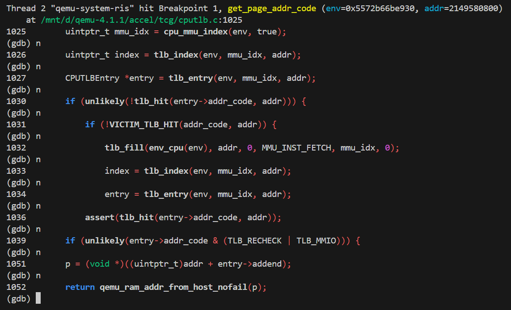

<h1 align="center"> 南开大学操作系统实验五 </h1>
<p align="center">
<a href="https://cc.nankai.edu.cn/"></a>
<a href="http://oslab.mobisys.cc/"></a>
</p>
<h5 align="center"><em>章壹程，仇科文，杨宇翔 </em></h5>
<p align="center">
  <a href="#练习0填写已有实验">练习0</a>|
  <a href="#练习1分配并初始化一个进程控制块需要编码">练习1</a>|
  <a href="#练习2为新创建的内核线程分配资源需要编码">练习2</a>|
  <a href="#练习3编写procrun函数需要编码">练习3</a>|
  <a href="#challenge">challenge</a>|
  <a href="#分工">分工</a>
</p>


---

## 练习0：填写已有实验（依赖 Lab2/3）

## 练习1：分配并初始化一个进程控制块（需要编码）

> 请说明proc_struct中`struct context context`和`struct trapframe *tf`成员变量含义和在本实验中的作用是啥？（提示通过看代码和编程调试可以判断出来）


## 练习2：为新创建的内核线程分配资源（需要编码）

> 请说明ucore是否做到给每个新fork的线程一个唯一的id？请说明你的分析和理由。


## 练习3：编写 `proc_run` 函数（需要编码）

> 在本实验的执行过程中，创建且运行了几个内核线程？


## Challenge 1：`local_intr_save/restore` 与中断控制

> 题目要求：说明语句`local_intr_save(intr_flag);....local_intr_restore(intr_flag);`是如何实现开关中断的？


## Challenge 2：`get_pte()` 的设计分析

> 题目要求：深入理解不同分页模式的工作原理（思考题）
>
> get_pte()函数（位于`kern/mm/pmm.c`）用于在页表中查找或创建页表项，从而实现对指定线性地址对应的物理页的访问和映射操作。这在操作系统中的分页机制下，是实现虚拟内存与物理内存之间映射关系非常重要的内容。
>
> - get_pte()函数中有两段形式类似的代码， 结合 sv32，sv39，sv48 的异同，解释这两段代码为什么如此相像。
> - 目前 get_pte()函数将页表项的查找和页表项的分配合并在一个函数里，你认为这种写法好吗？有没有必要把两个功能拆开？


## 分支任务：gdb调试页表查询过程 (lab2)

> 1. 尝试理解我们调试流程中涉及到的qemu的源码，给出关键的调用路径，以及路径上一些**关键的分支语句（不是让你只看分支语句）**，并通过调试演示某个访存指令访问的虚拟地址是**如何在qemu的模拟中被翻译成一个物理地址的**。


qemu中翻译虚拟地址的核心函数为：

 **get_page_addr_code** ( CPUArchState *env, target_ulong addr )  。 


函数首先会尝试最快速的路径：查询 TLB（Translation Lookaside Buffer，转址旁路缓存）。QEMU 维护了这个缓存来加速 **客户机虚拟地址（GVA）**到 **主机虚拟地址（HVA）**的转换。

```c++
uintptr_t mmu_idx = cpu_mmu_index(env, true); // 获取当前MMU索引
uintptr_t index = tlb_index(env, mmu_idx, addr); // 计算TLB索引
CPUTLBEntry *entry = tlb_entry(env, mmu_idx, addr); // 获取对应的TLB表项
```


然后代码通过  `tlb_hit(entry->addr_code, addr)` 判断 **TLB是否命中**。如果命中，说明转换结果已经缓存，可以直接使用。

```c++
if (unlikely(!tlb_hit(entry->addr_code, addr)))
```


如果 TLB 未命中（ `tlb_hit` 返回  `false `），则意味着缓存中没有现成的转换结果，这时就会调用 `tlb_fill` 函数。

```c++
if (!VICTIM_TLB_HIT(addr_code, addr)) {
	tlb_fill(env_cpu(env), addr, 0, MMU_INST_FETCH, mmu_idx, 0);
	index = tlb_index(env, mmu_idx, addr);
	entry = tlb_entry(env, mmu_idx, addr);
}
```

`tlb_fill` 是处理过程中的核心。它会模拟客户机操作系统的页表遍历过程。这个过程完成了从**客户机虚拟地址（GVA）** 到 **客户机物理地址（GPA）** 的转换。随后，QEMU 的内存管理模块会将 **GPA** 映射到 QEMU 进程自身的 **主机虚拟地址（HVA）**。最终，`tlb_fill` 会将计算出的 **HVA 与 GPA 的映射关系** 填充回 TLB 缓存，以备后续快速查找。


在成功通过 TLB 获取到映射条目后，函数会检查条目中的特殊标志位，如 `TLB_MMIO`（表示内存映射I/O）或 `TLB_RECHECK`（表示需要重新检查）。如果设置了这些标志，函数通常返回 `-1`，表示无法直接从该页面执行代码，需要特殊处理 1。

```c++
 if (unlikely(entry->addr_code & (TLB_RECHECK | TLB_MMIO))) {
        /*
         * Return -1 if we can't translate and execute from an entire
         * page of RAM here, which will cause us to execute by loading
         * and translating one insn at a time, without caching:
         *  - TLB_RECHECK: means the MMU protection covers a smaller range
         *    than a target page, so we must redo the MMU check every insn
         *  - TLB_MMIO: region is not backed by RAM
         */
        return -1;
 }
```


如果没有特殊标志，函数就进行最终的地址计算：

```c++
p = (void *)((uintptr_t)addr + entry->addend);
```

这里的 `entry->addend`存储的是 **GPA 到 HVA 的偏移量**。通过 `addr + addend`，就得到了对应的主机虚拟地址。


最后，函数通过 `qemu_ram_addr_from_host_nofail(p)` 将这个 **HVA** 转换成一个 QEMU 内部管理内存块使用的 `tb_page_addr_t` 类型地址（可理解为 GPA 在 QEMU 内存布局中的表示）并返回。

```c++
return qemu_ram_addr_from_host_nofail(p);
```


**调试时**，我们在终端2中添加条件断点：

```
(gdb) b get_page_addr_code if addr == 0x80200000
```

在终端3中的内核入口处添加断点：

```
(gdb) b *0x80200000
```

最终观察到以下路径：



可以看到此次访问 **TLB 未命中** ，调用了 `tlb_fill` 函数。


> 2. 单步调试页表翻译的部分，解释一下关键的操作流程。（这段是地址翻译的流程吗，我还是没有理解，给我解释的详细一点 / 这三个循环是在做什么，这两行的操作是从当前页表取出页表项吗，我还是没有理解）


页表翻译的核心函数为：

**get_physical_address** ( CPURISCVState *env, hwaddr *physical, int *prot, target_ulong addr, 

​										   int access_type, int mmu_idx )

这个函数模拟了RISC-V页表的遍历过程。


函数首先检查当前的CPU特权级别和内存管理配置。如果处于**机器模式（M-mode）** 或 **未启用MMU**（如`sv32`、`sv39`等分页模式），则系统使用**物理地址直接映射**。此时，虚拟地址直接被当作物理地址返回，并赋予完整的读、写、执行权限。

如果启用了MMU，函数会从**SATP（Supervisor Address Translation and Protection）寄存器**中获取**页表基地址**和当前激活的页表模式（例如SV39、SV48）。

```c++
    if (mode == PRV_M && access_type != MMU_INST_FETCH) {
        if (get_field(env->mstatus, MSTATUS_MPRV)) {
            mode = get_field(env->mstatus, MSTATUS_MPP);
        }
    }

    if (mode == PRV_M || !riscv_feature(env, RISCV_FEATURE_MMU)) {
        *physical = addr;
        *prot = PAGE_READ | PAGE_WRITE | PAGE_EXEC;
        return TRANSLATE_SUCCESS;
    }
```


之后，函数进入页表遍历流程。代码通过读取 `satp`寄存器的 `MODE`字段，确定当前活跃的分页方案。然后从 `satp`寄存器指定的根页表物理地址开始，结合虚拟地址的 `VPN`段，逐级计算下一级页表或最终页面的物理地址。

```c++
// 计算当前级别PTE的地址
target_ulong pte_addr = base + idx * ptesize;
// 从内存中读取PTE
target_ulong pte = ldq_phys(cs->as, pte_addr);
```

每一级页表项（PTE）都是一个 64 位的字，其中包含下一级页表的**物理页号（PPN）** 或最终物理页的 PPN，以及重要的控制标志位。

如果 PTE 的 `R`、`W`、`X`权限位全为 0，表示它是一个**指向下一级页表的指针**（非叶子 PTE），需要继续遍历。否则，它是一个**叶子 PTE**，其 PPN 就是目标物理页的页号 。


成功找到叶子 PTE 后，将叶子 PTE 中的 **PPN** 左移 12 位，然后与原始虚拟地址中的低 12 位**页内偏移**进行组合，得到最终的物理地址。

```c++
*physical = (ppn | (vpn & ((1L << ptshift) - 1))) << PGSHIFT;
```


**调试时**，我们在终端2中添加断点：

```
(gdb) b /mnt/d/qemu-4.1.1/target/riscv/cpu_helper.c:237
```

终端3中不添加断点直接 continue


最终观察到以下路径：


可以看到CPU在页表的第一级就找到了叶子页表项，计算出最终的物理地址，经过安全权限检查，返回成功。


> 3. 是否能够在qemu-4.1.1的源码中找到模拟cpu查找tlb的C代码，通过调试说明其中的细节。（按照riscv的流程，是不是应该先查tlb，tlbmiss之后才从页表中查找，给我找一下查找tlb的代码）


可以找到与查找tlb相关的几个函数 ：

```c++
/* Find the TLB index corresponding to the mmu_idx + address pair.  */
static inline uintptr_t tlb_index(CPUArchState *env, uintptr_t mmu_idx,
                                  target_ulong addr)
{
    uintptr_t size_mask = env_tlb(env)->f[mmu_idx].mask >> CPU_TLB_ENTRY_BITS;

    return (addr >> TARGET_PAGE_BITS) & size_mask;
}

/* Find the TLB entry corresponding to the mmu_idx + address pair.  */
static inline CPUTLBEntry *tlb_entry(CPUArchState *env, uintptr_t mmu_idx,
                                     target_ulong addr)
{
    return &env_tlb(env)->f[mmu_idx].table[tlb_index(env, mmu_idx, addr)];
}

/**
 * tlb_hit_page: return true if page aligned @addr is a hit against the
 * TLB entry @tlb_addr
 *
 * @addr: virtual address to test (must be page aligned)
 * @tlb_addr: TLB entry address (a CPUTLBEntry addr_read/write/code value)
 */
static inline bool tlb_hit_page(target_ulong tlb_addr, target_ulong addr)
{
    return addr == (tlb_addr & (TARGET_PAGE_MASK | TLB_INVALID_MASK));
}

/**
 * tlb_hit: return true if @addr is a hit against the TLB entry @tlb_addr
 *
 * @addr: virtual address to test (need not be page aligned)
 * @tlb_addr: TLB entry address (a CPUTLBEntry addr_read/write/code value)
 */
static inline bool tlb_hit(target_ulong tlb_addr, target_ulong addr)
{
    return tlb_hit_page(tlb_addr, addr & TARGET_PAGE_MASK);
}
```

其中 **`tlb_index()`** 和  **`tlb_entry()`** 只是通过 虚拟地址 (`addr`) 和 MMU 索引 (`mmu_idx`) 直接计算结果，`tlb_index` 计算页表索引，`tlb_entry` 计算表项指针。 **`tlb_hit_page()`** 和  **`tlb_hit()`** 也只是判断两个地址是否相等。 主要的逻辑还是在第一问中提到的 **`get_page_addr_code ` **中，具体逻辑和调试细节已经在第一问中回答过了。


> 4. 仍然是tlb，qemu中模拟出来的tlb和我们真实cpu中的tlb有什么**逻辑上的区别**（提示：可以尝试找一条未开启虚拟地址空间的访存语句进行调试，看看调用路径，和开启虚拟地址空间之后的访存语句对比）


**调试时**，我们在终端2中添加断点：

```
(gdb) b get_physical_address if addr == 0x80200000
```

在终端3中的内核入口处添加断点：

```
(gdb) b *0x80200000
```

最终观察到以下路径：


可以看到此时由于在内核入口处，页表还没有建立，此时的虚拟地址被当作物理地址直接返回。

qemu中模拟出来的 tlb 和我们真实cpu中的 tlb 最根本的区别在于**并行性与串行性**。硬件TLB利用电路特性，可以同时比较所有表项，瞬间给出结果。而QEMU的软件TLB需要顺序遍历数组或链表，其性能随TLB大小增加而线性下降。


> 5. 记录下你调试过程中比较~~抓马~~有趣的细节，以及在观察模拟器通过软件模拟硬件执行的时候了解到的知识。

呃呃，上面的报告就是我了解到的知识。


> 6. 记录实验过程中，有哪些通过大模型解决的问题，记录下当时的情景，你的思路，以及你和大模型交互的过程。


*下面的实验内容要求我调试qemu的源码，但源码这么多，我上哪里找qemu中翻译虚拟地址到物理地址的代码啊？*

一开始对qemu源码无从下手，大模型直接告诉我 TLB 查询代码 在 qemu/accel/tcg/cputlb.c 里，页表遍历代码在 qemu/target/riscv/cpu_helper.c 里。


*针对第二个要求“单步调试页表翻译的部分，解释一下关键的操作流程”，我应该怎么单步调试？*

调试 **get_physical_address** 时，由于某些情况下会将虚拟地址当作物理地址直接提前返回，导致原本直接在函数上打断点的方法不能直接观察到查询页表的过程。询问大模型后得知了直接在文件内特定行打断点的方法。


## 分支任务：gdb调试页表查询过程 (lab5)

> 1. 在大模型的帮助下，完成整个调试的流程，观察一下ecall指令和sret指令是如何被qemu处理的，并简单阅读一下调试中涉及到的qemu源码，解释其中的关键流程。

### qemu处理ecall的核心函数为：

void **riscv_cpu_do_interrupt** ( CPUState *cs )


这个函数集中处理了CPU的中断和异常，包括 ecall 和 eret 。


首先提取 cs 中的异常信息：

```c++
RISCVCPU *cpu = RISCV_CPU(cs);
CPURISCVState *env = &cpu->env;
bool async = !!(cs->exception_index & RISCV_EXCP_INT_FLAG);
target_ulong cause = cs->exception_index & RISCV_EXCP_INT_MASK;
target_ulong deleg = async ? env->mideleg : env->medeleg;
```

这里决定了后续处理的分支情况。


然后针对ecall，有以下代码片段：

```c++
if (cause == RISCV_EXCP_U_ECALL) {
    assert(env->priv <= 3);
    cause = ecall_cause_map[env->priv]; // 根据发生ecall时的特权级映射到最终原因
}
```

这段代码将通用的 `ecall`异常根据发生时的特权级（U, S, H, M）映射到更具体的原因（如 `RISCV_EXCP_S_ECALL`），这样操作系统就能区分是来自 **U模式** 的系统调用还是来自 **S模式** 的环境调用 ，从而在后续处理中决定应该在哪个特权级处理。

后续执行**保存上下文**，以及**模式切换**等操作。


### qemu 处理 eret 的核心函数为：

target_ulong **helper_sret**( CPURISCVState *env, target_ulong cpu_pc_deb )

它的核心作用是 从监管者模式（通常为 S 模式）返回到 发生陷阱前的状态（通常是 U 模式）


首先确认当前 CPU 特权级至少为监管者模式（S-mode）。`sret`指令只能在 S-mode 或更高特权级下执行，否则视为非法指令。

```c++
if (!(env->priv >= PRV_S)) {
    riscv_raise_exception(env, RISCV_EXCP_ILLEGAL_INST, GETPC());
}
```


然后进行状态恢复与上下文切换:

```c++
	target_ulong mstatus = env->mstatus;
    target_ulong prev_priv = get_field(mstatus, MSTATUS_SPP);
    mstatus = set_field(mstatus,
        env->priv_ver >= PRIV_VERSION_1_10_0 ?
        MSTATUS_SIE : MSTATUS_UIE << prev_priv,
        get_field(mstatus, MSTATUS_SPIE));
    mstatus = set_field(mstatus, MSTATUS_SPIE, 0);
    mstatus = set_field(mstatus, MSTATUS_SPP, PRV_U);
    riscv_cpu_set_mode(env, prev_priv);
    env->mstatus = mstatus;
```

最后返回从 `sepc`获取的地址 `retpc`，使得 CPU 能够从 trap 发生时的位置继续执行用户程序。

```c++
target_ulong retpc = env->sepc;

return retpc;
```


### 调试

先在终端3中添加断点：

```
(gdb) add-symbol-file obj/__user_exit.out
(gdb) break user/libs/syscall.c:18
```

触发断点后，可以得到下面的指令序列：


此时在终端2中添加断点：

```
(gdb) handle SIGPIPE nostop noprint
(gdb) b riscv_cpu_do_interrupt
```

继续运行并单步调试。

最终观察到以下路径：


此时引起中断的是 **ecall**，可以观察到 :

1. **async = false**，这表明当前是一个同步异常，由指令执行本身引发（例如 ecall），而非外部中断。
2. **cause** 在 switch 分支中被识别为 **RISCV_EXCP_U_ECALL **。
3. 经过检查后本次系统调用由内核（ **S 模式** ）处理。
4. 经过一系列数据保存和跳转后，调用 `riscv_cpu_set_mode(env, PRV_S)`将 CPU 模式切换到 S 模式。


为了观察 eret ，我们重复上述的调试流程，但是更改终端2中的断点：

```
(gdb) b helper_sret
```

最终观察到以下路径：


可以看到程序完整执行了整个 **安全检查**、**恢复上下文**、**切换特权模式**、**返回** 的过程。


> 2. 在执行ecall和sret这类汇编指令的时候，qemu进行了很关键的一步——指令翻译（TCG Translation），了解一下这个功能，思考一下另一个双重gdb调试的实验是否也涉及到了一些相关的内容。


**系统调用实验中的 `ecall`/`sret`** 

在GDB中单步执行 `ecall`指令时，表面上是“一步”操作，但背后是QEMU通过TCG生成的一整段主机代码在模拟执行。这段代码完成了从用户态陷入内核态的所有工作：触发异常、查询 `stvec`寄存器、跳转到异常处理程序入口等。`sret`指令的处理同理。您在使用双重GDB调试时，在QEMU源码层面观察到的 `riscv_cpu_do_interrupt`等函数，正是TCG在生成主机代码过程中会调用的辅助函数，它们共同构成了模拟硬件行为的关键逻辑。

**页表查询实验中的地址转换** 

在页表查询实验中，当TLB未命中时，QEMU需要模拟MMU进行多级页表遍历。这个遍历过程本身也是由客户机指令（内存加载、位操作、条件判断等）组成的。QEMU同样会通过TCG将这些指令翻译成主机代码来执行。因此，您当时单步调试的页表遍历代码，本质上也是在TCG生成的翻译块中运行的。


## 分工

- [章壹程](https://github.com/u2003yuge)：负责练习0、练习3的代码实现与报告撰写。
- [仇科文](https://github.com/luyanhexay)：负责 Challenge 题目的思考与实现，撰写 Challenge 部分报告。  
- [杨宇翔](https://github.com/sheepspacefly)：负责练习1、练习2 的代码实现与报告撰写。
